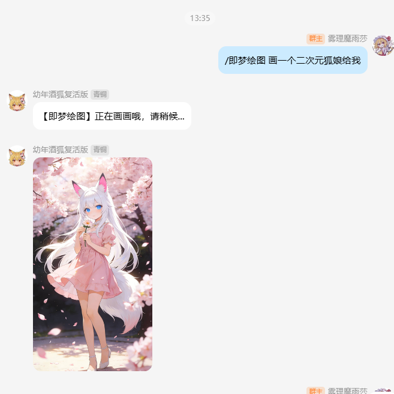
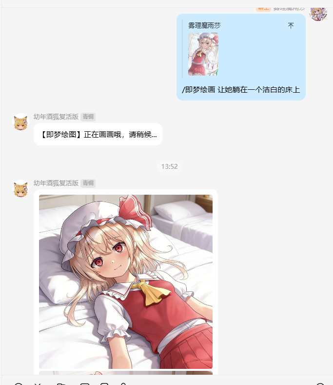

<div align="center">
    <a href="https://v2.nonebot.dev/store">
    </a>

## ✨ 即梦绘画 ✨
[](./LICENSE)
[](https://pypi.python.org/pypi/nonebot-plugin-jimeng)
[](https://www.python.org)
[](https://github.com/astral-sh/uv)
<br/>
[](https://github.com/astral-sh/ruff)
[](https://results.pre-commit.ci/latest/github/FlanChanXwO/nonebot-plugin-jimeng/master)

</div>

## 📖 介绍

一个基于 NoneBot2 的 AI 绘画插件，通过调用**即梦（Jimeng）**的 OpenAPI 实现文生图和图生图功能。

- **文生图**：根据文本描述生成图片。
- **图生图**：结合图片和文本描述生成新的图片。
- **多账号支持**：内置简单的多账号轮询和积分管理机制。

## 💿 安装

<details open>
<summary>使用 nb-cli 安装 (推荐)</summary>
在 nonebot2 项目的根目录下打开命令行, 输入以下指令即可安装

    nb plugin install nonebot-plugin-jimeng --upgrade

</details>

<details>
<summary>使用包管理器安装</summary>
在 nonebot2 项目的插件目录下, 打开命令行, 根据你使用的包管理器, 输入相应的安装命令

<details>
<summary>pip</summary>

    pip install nonebot-plugin-jimeng

</details>
<details>
<summary>pdm</summary>

    pdm add nonebot-plugin-jimeng

</details>
<details>
<summary>poetry</summary>

    poetry add nonebot-plugin-jimeng

</details>
<details>
<summary>uv</summary>

    uv pip install nonebot-plugin-jimeng

</details>

</details>

安装后，请打开 nonebot2 项目根目录下的 `pyproject.toml` 文件, 在 `[tool.nonebot]` 部分的 `plugins` 列表中添加 `nonebot_plugin_jimeng` 以加载插件。

    [tool.nonebot]
    plugins = [
        # ... other plugins
        "nonebot_plugin_jimeng"
    ]


## ⚙️ 配置

在 nonebot2 项目的`.env`或`.env.prod`文件中添加下表中的配置。

| 配置项 | 必填 | 默认值 | 说明 |
| :---: | :---: | :---: | :--- |
| `JIMENG_ACCOUNTS` | **是** | `[]` | 即梦账号列表，格式为 `[{"email": "user1@example.com", "credit": 1000}, ...]` |
| `JIMENG_SECRET_KEY_PREFIX` | **是** | `""` | 即梦 `session_id` 的固定前缀，通常是 `sess-` |
| `JIMENG_OPEN_API_URL` | 否 | `https://api.jimmeng.com/api` | 即梦 OpenAPI 的地址 |
| `JIMENG_MODEL` | 否 | `jimeng-diffusion-fast` | 使用的绘画模型 |
| `JIMENG_MODEL_COST` | 否 | `20` | 单次绘图消耗的积分 |
| `JIMENG_RESOLUTION` | 否 | `1024x1024` | 图片分辨率 |
| `JIMENG_RATIO` | 否 | `1:1` | 图片比例，如 "1:1", "16:9", "9:16" 等。若未设置，文生图将启用智能比例 |

### `JIMENG_ACCOUNTS` 格式说明
这是一个 JSON 字符串数组，每个对象代表一个即梦账号。插件启动时会根据此配置初始化 `session_id`。

**示例：**
```env
# .env.prod
JIMENG_ACCOUNTS='[{"email": "your_email1@example.com", "credit": 10000}, {"email": "your_email2@example.com", "credit": 5000}]'
JIMENG_SECRET_KEY_PREFIX="sess-"
```
**注意**：由于 `.env` 文件格式限制，请确保整个 JSON 数组写在同一行，并用单引号或双引号包裹。

## 🎉 使用

### 指令表
| 指令 | 说明 |
| :---: | :--- |
| `/即梦绘画 <关键词>` | **文生图**。根据提供的关键词进行创作。 |
| `/即梦绘画 <关键词>` (回复图片) | **图生图**。回复一张图片，并附上关键词，将在原图基础上进行创作。 |

### 🎨 效果图
**文生图**
```
/即梦绘画 画一个二次元狐娘给我
```


**图生图**
(回复一张图片)
```
/即梦绘画 让她躺在一个洁白的床
```
